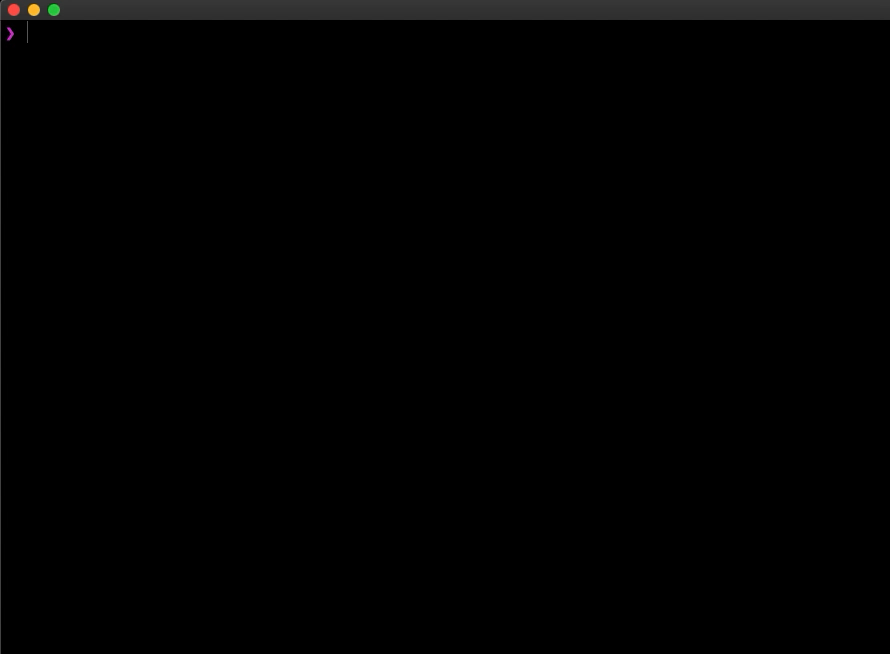

<p align="center">
    
</p>

## About

Search for LoL champion builds right from your cli.

## Installation

```console
# clone the repo
$ git clone https://github.com/hbswift/LoL_champ_build.git

# install the requirements
$ python3 -m pip install -r requirements.txt
```

## Usage

```console
# list all available champions
python3 champ.py champion -l
```

To search for a champion build:
```
python3 champ.py [champion]
```

## License

MIT